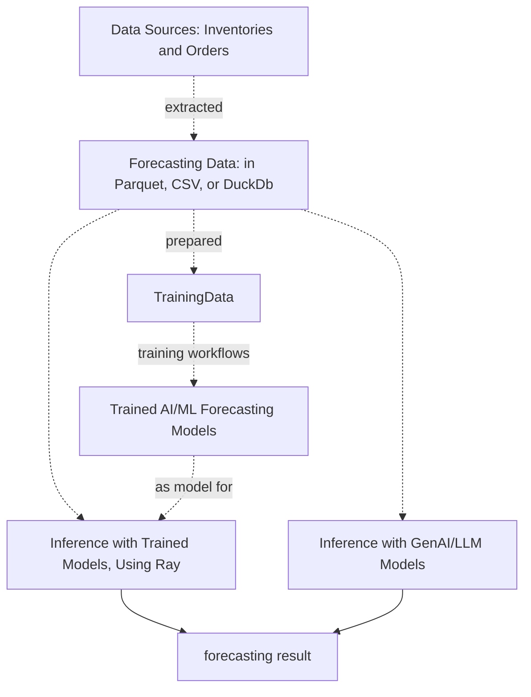
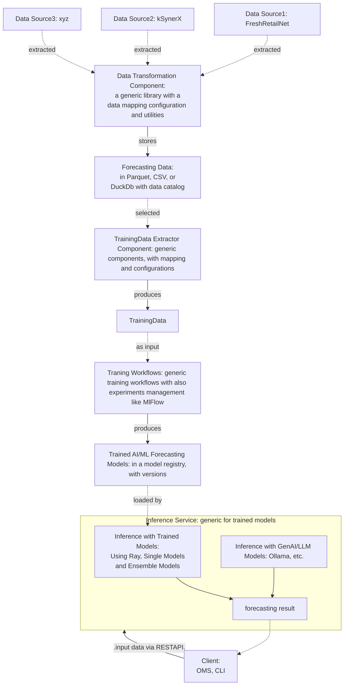

# Demand forecasting Project for Internships at kSynerX

The goal of this work is to test models for demand forecasting, including:

- prepare data suitable for training
- train various forecasting models
- evaluate the quality of models
- suggest ways to update training data and retrain
- suggest ways to use models via model serving

## Required Data

The basic data used for demand forecasting includes the following fields:

| Name | Description|
| --- | --- |
| product_id | the id of the product, also sku_id,  product id|
| date | timestamp when the product is sold |
| units_ordered | the number of units sold/ordered |
| stock_on_hand | the units are in the stock before selling |
| stockout_flag | true/1, false/0, if we still have the product in the inventory |
| selling_price | the price we sell, the markdown price |
| product_price | the price of the product - base price|
| product_category | the main product category |
| product_subcategory | the sub category of the product, based on our family tree|
| is_promotion | id of the promotion if have |
| promotion_type | id of the type of the promotion |
| day_of_week| extract from the date |
| week_of_year| extract from the date |
| month| extract from the date |
| year | extract from the date |
| location| the location where the product is sold, maybe similar to store_id |
| store_id | if the tenant has many stores - it can be used for filtering/aggregating|
| holiday | if have, e.g., TET, NationalDay, ...|
| weather_condition | optional, maybe good for foods |
| is_bulk_order | optional, usually only for big business, b2b, based on quality_sold |

> Some field names can be revised to sync with the kSynerX data fields.
> Some additional fields can be added or some can be removed, subject to the change in the work.

## Selected AI/ML Algorithms/Models

We focus on a subset of AI/ML algorithms/models to see the feasibility of 
forecasting. It is possible to improve the list with more algorithms. 
Also some algorithms can be removed if not possible/suitable.

Algorithms/models for testing:

- **ARIMA / SARIMA** 
- **Exponential Smoothing (ETS / Holt-Winters)**
- **Linear Regression / Ridge / Lasso**
- **Random Forest / Gradient Boosting (XGBoost, LightGBM, CatBoost)**  
- **k-Nearest Neighbors (kNN)**
- **LSTM / GRU**
- **GenAI / LLM Forecasting** (e.g., Google TimesFM)

## Workflow

A high-level flow of the work:

## Implementation and Evaluation

- Two data sources:
   - **Phase 1**: Using FreshRetailNet-50 to build a ForecastingData dataset: for this one the intern must build the dataset
   - **Phase 2**: kSynerX's provided ForecastingData dataset (the data sources are in kSynerX): for this one, the intern does not need to build the ForecastingData dataset

**Phase 1**:

- Build workflows for preparing data and training models as described in the previous section. It is important to have a good way to make the training pipelines configurable and generic.
- Evaluate the quality of trained models.

**Phase 2**:

- Train with kSynerX dataset
- Put all trained models into a serving (e.g., Ray) and demonstrate examples of clients calling inferences.
- Evaluating also GenAI models.

## Moving to a Robust Forecasting System

To continue from the previous internship work, we now focus on building a robust forecasting system.

Key components:

Essentially we have three subsystems:

- transforming data to forecasting data according our schema, managing with DuckDb and Parquet
- extract forecasting data for training data and train ML models
- provide ML models for client via Ray.
  
Key activities:

- generic way to transform data from sources into forecasting data: we have different mappings, functions, utilities to transform any possible data into our forecasting data
- currently one schema for forecasting data defined aboved
- generic way to manage forecasting data, which can be updated/added by the data transformation
- generic way to take forecasting data and prepare training data suitable for training our selected AI/ML models
- manage models in a model registry
- generic way to deploy selected models and ensembles into Ray, making API ready for clients to call.

>Starting: keep the same FreshRetailNet data as the source, but focus on making other parts generic for only the top three best models. After that we will extend the new data source. Make sure generic components work is the most **important** point.

## References

- https://huggingface.co/datasets/Dingdong-Inc/FreshRetailNet-50K
- https://github.com/rdsea/sys4bigml/tree/master/tutorials/MLProjectManagement
- https://arxiv.org/abs/2505.16319
- https://www.kaggle.com/datasets/atomicd/retail-store-inventory-and-demand-forecasting
- https://www.kaggle.com/datasets/jayjoshi37/inventory-demand-forecasting-and-stockout-risk
- https://www.kaggle.com/competitions/m5-forecasting-accuracy
- https://www.kaggle.com/competitions/store-sales-time-series-forecasting
- https://github.com/google-research/timesfm

